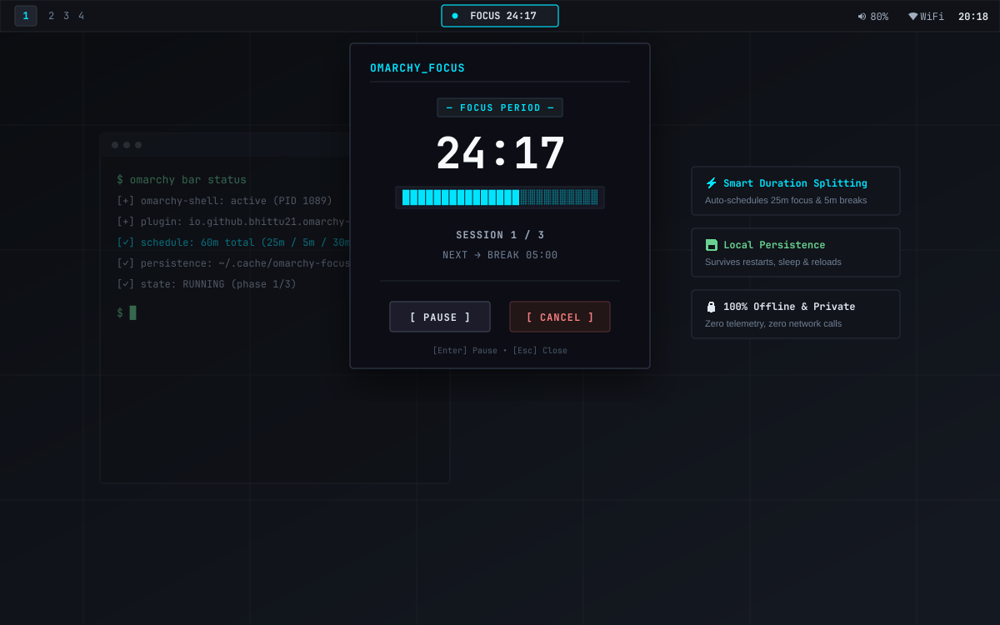

# Omarchy Focus Timer

A minimal offline focus timer with automatic breaks for Omarchy Quattro.



## Features

- **Smart focus/break scheduling**: Enter total duration; the plugin automatically structures focused sprints and 5-minute restorative breaks.
- **Strict duration accuracy**: Breaks count toward your total session. The timer never finishes early and never runs over.
- **Custom duration & presets**: One-click presets (25, 45, 60, 90) plus custom duration input up to 24 hours.
- **Pause/resume anytime**: Freeze the countdown at any second (during focus or break) without restarting phases or drifting.
- **Local persistence**: State survives closing the panel, bar reloads, Omarchy shell restarts, and computer suspend/sleep.
- **Offline & private**: Zero network calls, zero telemetry, zero analytics, zero external daemons.
- **Completion chime & notification**: Concise desktop alert and clean bundled audio chime only when the entire session finishes.
- **Terminal aesthetic**: Minimalist dark UI with crisp thin borders, monospace typography, and ASCII progress bar.
- **Compact bar widget**: Discrete indicator on your Omarchy status bar.

---

## How Scheduling Works

You specify the **total session duration** you want to spend. The plugin calculates an optimal schedule internally:

- **≤ 40 minutes**: One continuous focus period with no breaks.
- **> 40 minutes**: Automatically schedules 5-minute breaks between focus periods, targeting ~25 minutes of focus per period.
- **Exact elapsed invariant**:
  $$\sum \text{focus durations} + \sum \text{break durations} = \text{requested total duration}$$

### Schedule Examples

| Requested Duration | Schedule Breakdown |
|---|---|
| **25 min** | `FOCUS 25:00` |
| **30 min** | `FOCUS 30:00` |
| **40 min** | `FOCUS 40:00` |
| **45 min** | `FOCUS 20:00` → `BREAK 05:00` → `FOCUS 20:00` |
| **60 min** | `FOCUS 25:00` → `BREAK 05:00` → `FOCUS 30:00` |
| **75 min** | `FOCUS 25:00` → `BREAK 05:00` → `FOCUS 25:00` → `BREAK 05:00` → `FOCUS 15:00` |
| **90 min** | `FOCUS 25:00` → `BREAK 05:00` → `FOCUS 25:00` → `BREAK 05:00` → `FOCUS 30:00` |
| **120 min** | `FOCUS 25:00` → `BREAK 05:00` → `FOCUS 25:00` → `BREAK 05:00` → `FOCUS 25:00` → `BREAK 05:00` → `FOCUS 30:00` |

---

## Installation

### Via Official Omarchy CLI

```bash
omarchy plugin add https://github.com/bhittu21/omarchy-focus-timer.git --enable
```

### Manual Installation

Clone directly into the Omarchy plugins directory:

```bash
git clone https://github.com/bhittu21/omarchy-focus-timer.git ~/.config/omarchy/plugins/io.github.bhittu21.omarchy-focus-timer
omarchy-shell shell rescanPlugins
omarchy plugin enable io.github.bhittu21.omarchy-focus-timer
```

To position the widget in a specific bar section (e.g. `center`):

```bash
omarchy bar move io.github.bhittu21.omarchy-focus-timer --section center
```

---

## Removal

To completely disable and remove the plugin:

```bash
omarchy plugin remove io.github.bhittu21.omarchy-focus-timer
```

---

## Keyboard Navigation

- **Click** bar widget: Open / toggle panel.
- **Escape**: Close the panel.
- **Enter**:
  - When idle with custom input focused: Start timer.
  - When timer is running: Pause timer.
  - When timer is paused: Resume timer.

---

## Development & Validation

### Validate Plugin Manifest

```bash
omarchy plugin validate .
```

### Run QML Linting

```bash
qmllint -I "$OMARCHY_PATH/shell" BarWidget.qml Panel.qml
```

### Run Automated Test Suite

```bash
node tests/run-tests.js
```

---

## Offline & Privacy Statement

This plugin operates entirely offline:

- No network sockets or HTTP requests.
- No telemetry, analytics, or metric gathering.
- No user tracking, cloud synchronization, or accounts.
- Local state is strictly stored in `~/.cache/omarchy-focus-timer/state.json`.

---

## Compatibility

- Designed and tested on **Omarchy Quattro (4.0.1+)**.
- Compatible with **Quickshell** on Wayland / Hyprland.
- Uses native `qs.Ui` and `qs.Commons` components.

---

## License

MIT License. See [LICENSE](LICENSE) for full details.
Audio asset `assets/complete.wav` is dedicated to the public domain under CC0 1.0 Universal / MIT.
# omarchy-focus-timer
